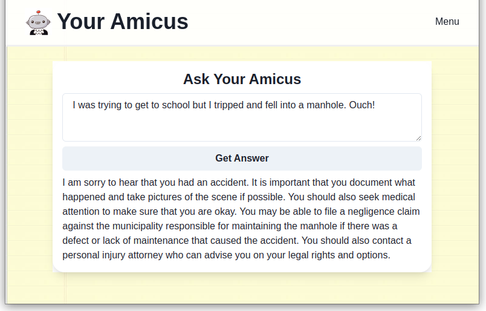

# Your Amicus

This is a Pynecone project using GPT-3 to create a legal Chatbot.

*This project is in active development and not meant to be used
as a product.*

## Contributing

As I am experimenting with this (I have no idea what is the scope
or the actual aim of this project),
I am not accepting contributions actively.

You can send any feedback to me via
[email](mailto:houfu@lovelawrobots.com)
or [toot at me](https://kopiti.am/@houfu).

## Running this project

1. Clone this project
2. Set up poetry environment (After installing poetry, run `poetry install` in the project directory.)
3. Ensure your OpenAI Key is in the environment variables (key: OPENAI_API_KEY)
4. `pc run` to start a development backend and frontend server.